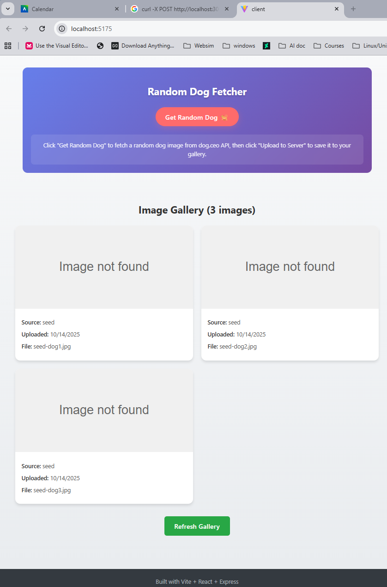
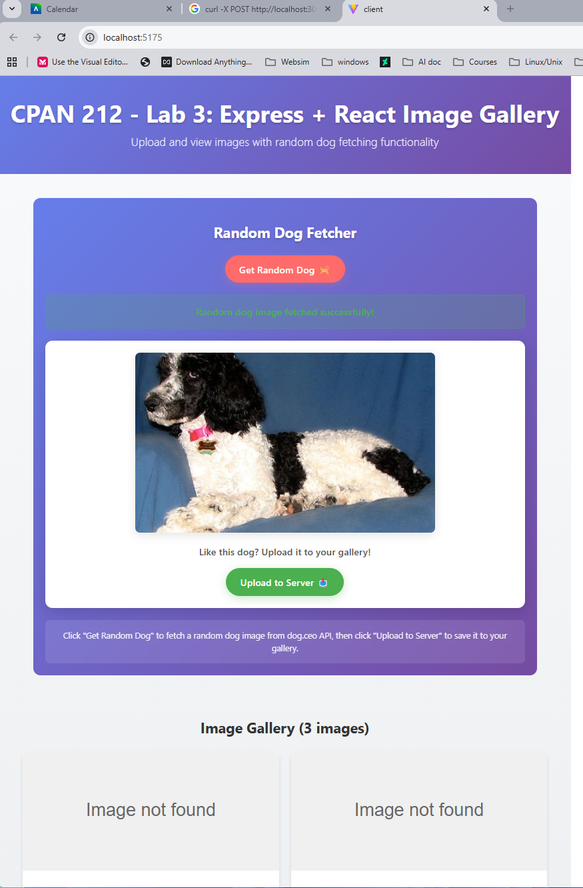
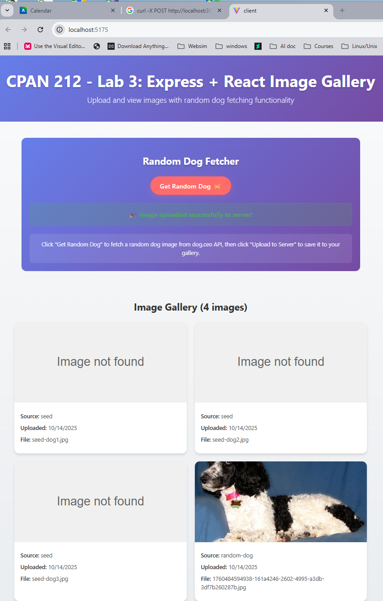
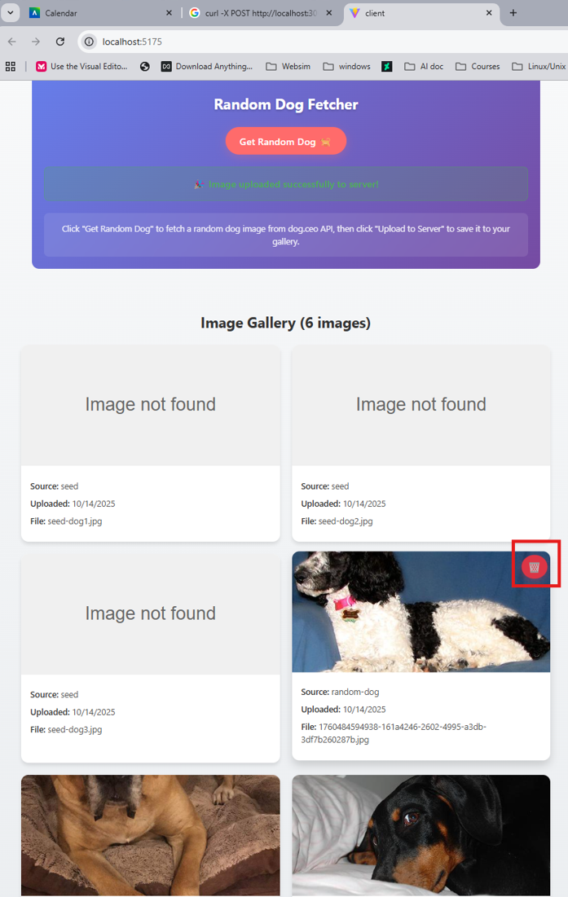
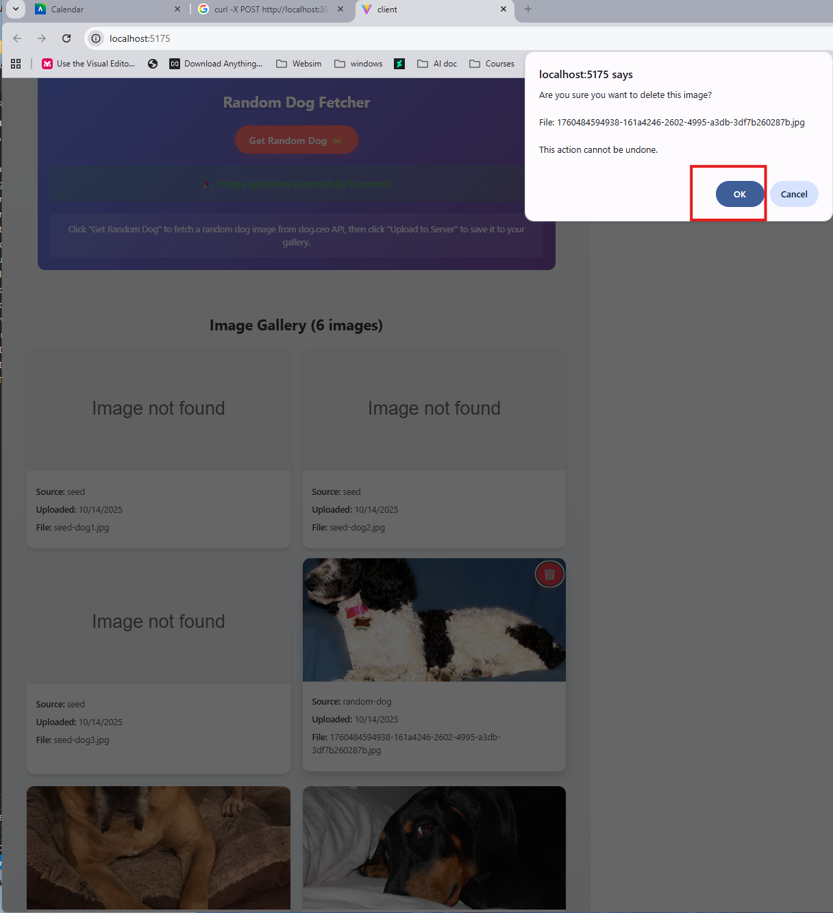
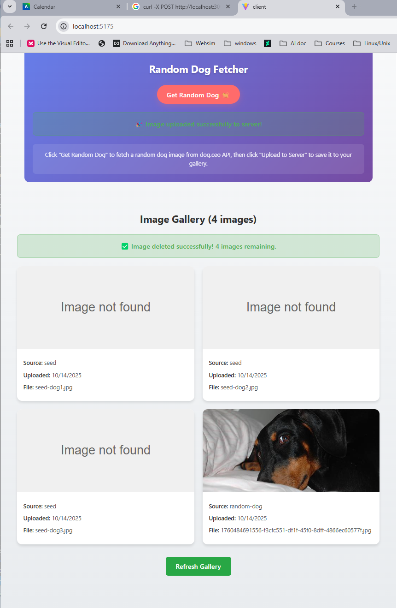
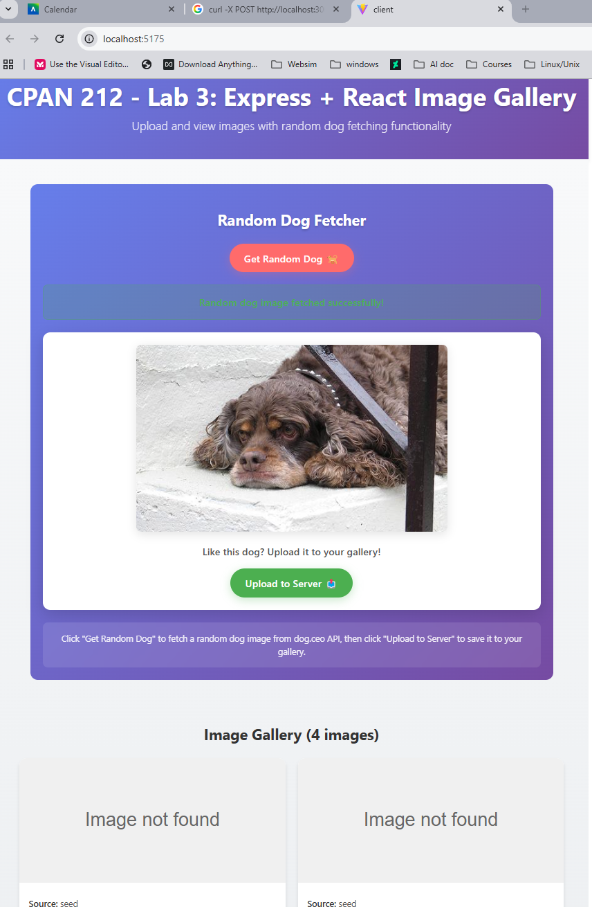

## Lab3 – Express + React Image Gallery

## Project Metadata
- Author: Harry Joseph
- subject: CPAN 212 - Modern Web Technology
- Created: 2025-10-14
- Platform: Full-Stack Web Application
- Backend: Express.js + Node.js
- Frontend: React 19 + Vite
- Package Manager: npm
- External API: dog.ceo API for random dog images

## Overview
Lab3 demonstrates a complete full-stack image gallery application with CRUD operations. The project showcases modern web development practices including RESTful API design, file upload handling, external API integration, and responsive React components with real-time updates.

## 📥 Quick Download

**Get the complete project instantly:**

[](https://github.com/hjoseph777/ModernWebTechology/archive/refs/heads/main.zip)

*Complete full-stack application ready to run with Express backend and React frontend*

## Important: Where your core application logic lives
- The main Express server is in [`Lab3/my-react-server/server.js`](Lab3/my-react-server/server.js) with middleware setup and route configuration
- The API routes are in [`Lab3/my-react-server/routes/images.js`](Lab3/my-react-server/routes/images.js) with complete CRUD operations
- The main React app is in [`Lab3/client/src/App.jsx`](Lab3/client/src/App.jsx) with component orchestration
- The image gallery component is in [`Lab3/client/src/components/ImageGallery.jsx`](Lab3/client/src/components/ImageGallery.jsx) with delete functionality
- The random dog fetcher is in [`Lab3/client/src/components/RandomDog.jsx`](Lab3/client/src/components/RandomDog.jsx) with external API integration

## Project Explorer
An interactive, collapsible view of the codebase. Click file names to open them.

<details open>
   <summary><strong>🖥️ my-react-server/ – Express Backend</strong></summary>

   - 📁 <strong>my-react-server</strong>
      - 🚀 [`server.js`](Lab3/my-react-server/server.js) – **Main Express server with middleware**
      - 📦 [`package.json`](Lab3/my-react-server/package.json) – Server dependencies & scripts
      - 📁 <strong>routes</strong>
         - 🛣️ [`images.js`](Lab3/my-react-server/routes/images.js) – **Complete image API (GET, POST, DELETE)**
      - 📁 <strong>data</strong>
         - 📊 [`images.json`](Lab3/my-react-server/data/images.json) – Image metadata storage
      - 📁 <strong>uploads</strong>
         - 🖼️ *User uploaded images stored here*
</details>

<details open>
   <summary><strong>⚛️ client/ – React Frontend</strong></summary>

   - 📁 <strong>client</strong>
      - 🏠 [`index.html`](Lab3/client/index.html) – HTML entry point
      - ⚙️ [`vite.config.js`](Lab3/client/vite.config.js) – **Vite config with API proxy**
      - 📦 [`package.json`](Lab3/client/package.json) – Client dependencies & scripts
      -  <strong>src</strong>
         - 🎯 [`App.jsx`](Lab3/client/src/App.jsx) – **Main React application**
         - 🎨 [`App.css`](Lab3/client/src/App.css) – Global application styles
         - 🔗 [`main.jsx`](Lab3/client/src/main.jsx) – React DOM entry point
         - 📁 <strong>components</strong>
            - 🖼️ [`ImageGallery.jsx`](Lab3/client/src/components/ImageGallery.jsx) – **Image gallery with delete**
            - 🎨 [`ImageGallery.css`](Lab3/client/src/components/ImageGallery.css) – Gallery styling
            - 🐕 [`RandomDog.jsx`](Lab3/client/src/components/RandomDog.jsx) – **Random dog API integration**
            - 🎨 [`RandomDog.css`](Lab3/client/src/components/RandomDog.css) – Random dog styling
</details>

<details>
   <summary><strong>📸 images/ – Screenshots & Documentation</strong></summary>

   - 📁 <strong>images</strong>
      - 🖼️ *Screenshots for README documentation*
</details>

<details>
   <summary><strong>📚 Documentation & Config</strong></summary>

   - 📝 [`README.md`](README.md) – **Project documentation (this file)**
   - 📋 [`README.txt`](Lab3/README.txt) – Plain text submission notes
   - 📜 [`commands.txt`](Lab3/commands.txt) – Command reference
   -  [`Example.md`](Lab3/Example.md) – Documentation template reference
</details>

## 🎯 Demo Gallery

**Live application screenshots showcasing the complete image gallery functionality:**

<div align="center">

### 📸 Screenshot 1: Initial Application Setup

*Initial application interface and setup*

### 📸 Screenshot 2: GET API Response

*GET /api/images endpoint returning JSON array of image objects*

### 📸 Screenshot 3: Initial Gallery Display  

*Image gallery showing initial seed data and responsive layout*

### 📸 Screenshot 4: Random Dog Fetching

*Random dog image fetched from dog.ceo API ready for upload*

### 📸 Screenshot 5: Image Upload Process

*File upload functionality with drag & drop or click to select*

### 📸 Screenshot 6: Updated Gallery

*Gallery updated with newly uploaded images showing real-time refresh*

### 📸 Screenshot 7: Server File Structure

*Backend uploads directory showing stored image files*

### 📸 Screenshot 8: POST API Response

*POST /api/images endpoint response with uploaded image metadata*

</div>

## 🌳 File Structure

```text
Lab3/
├── 📁 my-react-server/              # Express.js Backend Server
│   ├── 🚀 server.js                 # Main server entry point
│   ├── 📦 package.json              # Server dependencies & scripts
│   ├── 📁 routes/                   # API route definitions
│   │   └── 🛣️ images.js             # Image CRUD operations (GET, POST, DELETE)
│   ├── 📁 data/                     # JSON data storage
│   │   └── 📊 images.json           # Image metadata persistence
│   └── 📁 uploads/                  # User uploaded images directory
│       └── 🖼️ *.jpg, *.png, etc.    # Uploaded image files
│
├── 📁 client/                       # React Frontend Application  
│   ├── 🏠 index.html                # HTML entry point
│   ├── ⚙️ vite.config.js            # Vite bundler configuration + API proxy
│   ├── 📦 package.json              # Client dependencies & scripts
│   ├── 🔍 eslint.config.js          # Code linting rules
│   ├──  src/                      # React source code
│   │   ├── 🎯 App.jsx               # Main React application component
│   │   ├── 🎨 App.css               # Global application styling
│   │   ├── 🔗 main.jsx              # React DOM renderer entry point
│   │   ├── 🎨 index.css             # Base CSS styles
│   │   └── 📁 components/           # Reusable React components
│   │       ├── 🖼️ ImageGallery.jsx  # Image gallery with delete functionality
│   │       ├── 🎨 ImageGallery.css  # Gallery component styling
│   │       ├── 🐕 RandomDog.jsx     # Random dog API integration component
│   │       └── 🎨 RandomDog.css     # Random dog component styling
│   └── 📁 public/                   # Static assets directory
│
├── 📁 images/                       # Screenshots & documentation images
│   ├── 🖼️ 1screenshot.png          # Initial application setup
│   ├── 🖼️ 2screenshot.png          # GET API endpoint response
│   ├── 🖼️ 3screenshot.png          # Initial gallery display
│   ├── 🖼️ 4screenshot.png          # Random dog fetching demo
│   ├── 🖼️ 5screenshot.png          # Image upload process
│   ├── 🖼️ 6screenshot.png          # Updated gallery with new images
│   ├── 🖼️ 7screenshot.png          # Server file structure
│   └── 🖼️ 8screenshot.png          # POST API response
│
├── 📁 my-react-client/              # Alternative client directory (unused)
│
├── 📝 README.md                     # Comprehensive project documentation
├── 📋 README.txt                    # Plain text submission notes  
├── 📜 commands.txt                  # Terminal commands reference
└── 📖 Example.md                    # Documentation format reference
```

### 🎯 Quick Code Reference
| Icon | Type | Path | Purpose |
|------|------|------|---------|
| 🚀 | Server | [`Lab3/my-react-server/server.js`](Lab3/my-react-server/server.js) | **Main Express server with CORS & middleware** |
| 🛣️ | API | [`Lab3/my-react-server/routes/images.js`](Lab3/my-react-server/routes/images.js) | **Complete image CRUD operations** |
| 📊 | Data | [`Lab3/my-react-server/data/images.json`](Lab3/my-react-server/data/images.json) | Image metadata persistence |
| 🎯 | App | [`Lab3/client/src/App.jsx`](Lab3/client/src/App.jsx) | **Main React application component** |
| 🖼️ | Gallery | [`Lab3/client/src/components/ImageGallery.jsx`](Lab3/client/src/components/ImageGallery.jsx) | **Image gallery with delete functionality** |
| 🐕 | Fetcher | [`Lab3/client/src/components/RandomDog.jsx`](Lab3/client/src/components/RandomDog.jsx) | **Random dog API integration** |
| ⚙️ | Config | [`Lab3/client/vite.config.js`](Lab3/client/vite.config.js) | **Vite config with API proxy setup** |
| 🎨 | Style | [`Lab3/client/src/components/ImageGallery.css`](Lab3/client/src/components/ImageGallery.css) | Gallery component styling |
| 🎨 | Style | [`Lab3/client/src/components/RandomDog.css`](Lab3/client/src/components/RandomDog.css) | Random dog component styling |
| 🎨 | Style | [`Lab3/client/src/App.css`](Lab3/client/src/App.css) | Global application styling |
| 🏠 | HTML | [`Lab3/client/index.html`](Lab3/client/index.html) | HTML entry point |
| 🔗 | Entry | [`Lab3/client/src/main.jsx`](Lab3/client/src/main.jsx) | React DOM entry point |
| 📦 | Deps | [`Lab3/my-react-server/package.json`](Lab3/my-react-server/package.json) | Server dependencies & scripts |
| 📦 | Deps | [`Lab3/client/package.json`](Lab3/client/package.json) | Client dependencies & scripts |
| 🔍 | Lint | [`Lab3/client/eslint.config.js`](Lab3/client/eslint.config.js) | ESLint configuration |
|  | Docs | [`README.md`](README.md) | **Project documentation** |


### Prerequisites
- Node.js (v18 or higher)
- npm (v8 or higher)
- Modern web browser


## 🛠️ API Endpoints

| Method | Endpoint | Description | Response |
|--------|----------|-------------|----------|
| `GET` | `/api/images` | Get all images with metadata | JSON array of image objects |
| `POST` | `/api/images` | Upload new image file | JSON with uploaded image details |
| `DELETE` | `/api/images/:id` | Delete image by ID | JSON confirmation with remaining count |
| `GET` | `/uploads/:filename` | Serve uploaded image files | Image file (jpg, png, etc.) |
| `GET` | `/` | API documentation | JSON with available endpoints |

## 🎨 Features

### ✅ **Core Functionality**
- 📤 **Image Upload**: Drag & drop or click to upload images
- 🖼️ **Gallery Display**: Responsive grid layout with image previews
- 🐕 **Random Dog API**: Fetch and save random dog images from dog.ceo
- 🗑️ **Delete Images**: Remove images with confirmation dialog
- 🔄 **Real-time Updates**: Gallery updates immediately after operations

### ✅ **Technical Features**
- 🌐 **RESTful API**: Complete CRUD operations with proper HTTP methods
- 🔒 **File Validation**: Only image files accepted with size limits
- 🆔 **Unique Naming**: UUID-based filename generation prevents conflicts
- 📊 **Data Persistence**: JSON-based metadata storage
- 🚫 **CORS Enabled**: Cross-origin requests properly handled
- ⚡ **Proxy Setup**: Vite proxy for seamless API communication


## 🏗️ Architecture

This project demonstrates modern full-stack architecture:

- **Frontend**: React 19 with functional components and hooks
- **Backend**: Express.js with middleware-based architecture  
- **Storage**: File system with JSON metadata persistence
- **API**: RESTful endpoints with proper HTTP status codes
- **Build Tool**: Vite for fast development and optimized production builds
- **File Handling**: Multer for multipart form uploads with validation

---

*This project demonstrates modern full-stack web development techniques with React and Express.js, including external API integration and comprehensive CRUD operations.*
